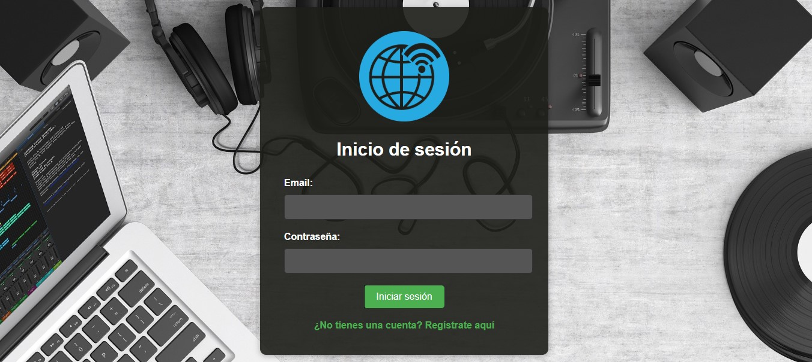
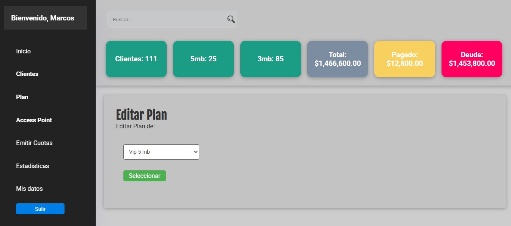
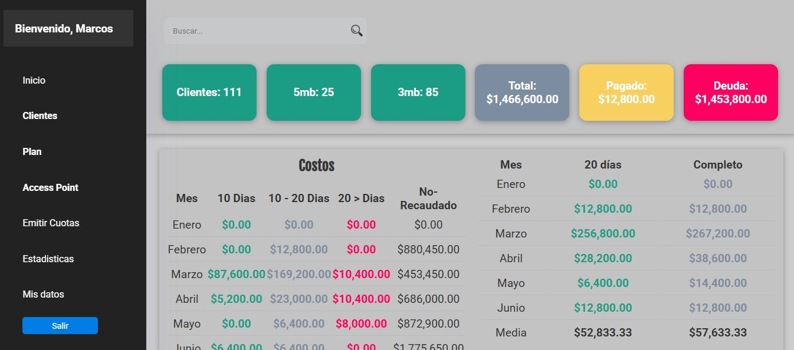
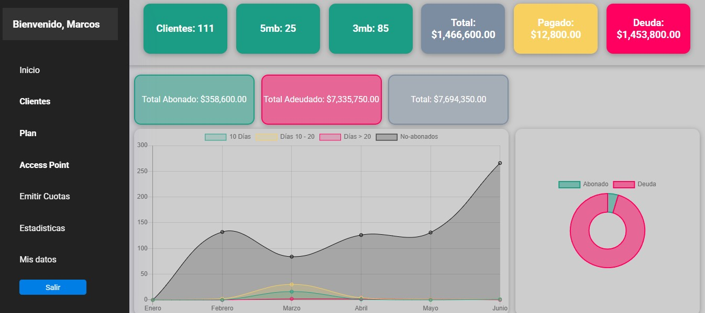

# Sistema de Gestión de Clientes para Servicios de Internet

Este proyecto es una solución web desarrollada en **PHP** para la gestión integral de clientes de servicios de internet. Permite el control de planes, cuotas, pagos, deudas y datos de contacto, pensado para proveedores que necesiten un sistema eficiente y accesible.

## 🚀 Características Principales

- 🧑‍💼 Registro y edición de clientes
- 📡 Asignación y administración de planes de internet
- 📆 Control de pagos por cuota mensual
- 💰 Gestión de deudas y recaudaciones
- 📊 Reportes mensuales por año y cuota
- 🔐 Autenticación de usuarios con manejo de sesiones
- 🌐 Interfaz con HTML y CSS

## Demo 

### 🧑 Pantalla de Login 


### 📦 Editar  


### 🌐 Inicio


### 📊 Estadísticas de ventas


## ⚙️ Tecnologías Utilizadas

- **PHP** como lenguaje principal del servidor
- **HTML/CSS** para la estructura y estilo de la interfaz
- **Composer** para la gestión de dependencias
- **Dotenv** para manejo seguro de variables de entorno
- **MySQL** para el almacenamiento de datos
- **JavaScript (opcional)** para interacciones dinámicas (selects, AJAX)

## 🔐 Configuración Inicial

1. Cloná el repositorio:
   ```bash
   git clone https://github.com/tuusuario/proyecto-internet-clientes.git 
   ```

2. Instala las dependencias:
    ```bash
    composer install
    ```
3. Copiá y configurá el archivo .env:

env
    HOST=localhost
    DB_USER=root
    DB_PASSWORD=tu_clave
    DB_DATABASE=internet_clientes
    DB_PORT=3306

4. Importá el archivo SQL de la base de datos.

    Iniciá el servidor:
    ```bash
    php -S localhost:8000 -t public
    ```
    
## 👤 Autor
    Marcos Alejandro
    📧 [Markof1089@outlook.com.ar]

## 📄 Licencia
    Este proyecto está licenciado bajo la Licencia Apache 2.0.
    Podés ver los detalles completos en el archivo LICENSE o visitar:
    https://www.apache.org/licenses/LICENSE-2.0